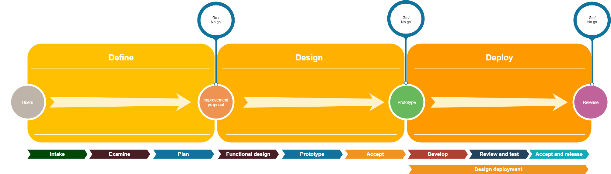

An improvement goes through the following phases:

Phase 1: Define

1. Intake
2. Examine
3. Plan

Phase 2: Design

1. Functional design
2. Prototype
3. Accept design

Phase 3: Realization

1. Develop
2. Review and test
3. Accept and release

## Phase 1: Define

**Deliverable:** An improvement proposal on how to solve the problem as Epic issue on github. This proposal is rated with a Go / No Go by: The development team, the requestor and the business.

#### Process:

*   Issue is opened in General repo from issue template 1
*   When the issue is opened, the opener fills template
*   Issue is created and automatically labeled, with initial labels; Phase 1 - Intake; Status - Not planned; 
*   Product owner or scrum master will start analyzation
*   Product owner, scrum master will label issue with result of analyzation
*   Product owner or scrum master will examine change request and will create an epic issue with a described solution. Solution will be proposed to requester.
*   Solution will be planned, a required budget will be set and deadline. The development team, requester and business will go/no go proposal. In same meeting a communication plan will be made. (if there is a go)

### Step 1: Intake

**Goal:** In this first phase, the request will be classified by the team. This lets the requester know the scope, impact and priority on this request.

**Deliverable:** 3 labels are added to the created issue. Go/no go decision is made.

##### How to analyze

_Scope_

Person responsible for doing intake will analyze the scope based on these points:

*    Design
*    Code
*    Infrastructure
*    Users
*    Finances
*    Processes

Based on how many of these areas are affected by requested change he will label:  \
Scope: small/medium/big/too big

_Impact:_ \
After termining scope person responsible will do an impact assessment based on two criteria: \
How many people are affected? How many people are happy with the solution? \
Determine impact label: (Small, Medium, High)

_Priority:_ \
After determining scope and impact, person responsible will judge priority based on closed deals, urgency: \
(MoSCoW: Must have, Should have, Could have, Won’t have) \
**Critical** is not a change request but most likely an incident: should be created in ITSM

Question: is it desirable to do examination about this request?

**Go**

It fixes current problems with the platform; a feature which enhances the current scope. it does not open a new area of expertise.

**No go**

Too big too chew on, completely out of scope, no time/budget to do research

### Step 2: Examine

**Goal:** In this step, the request will be examined. The start on a proposal is made on how to solve the problem. This proposal will be used to get a go / no go from the essential stakeholders.

Check problem statement of change request:

1. It should focus on only one problem. 
2. It should be one or two sentences long. 
3. You should be able to apply the 5 'W's (Who, What, Where, When and Why) to the problem statement. 

Pro contains:

*   What needs to be done
*   How it needs to be done
*   Why it will work
*   Why it is feasible and reasonable as a solution
*   Why it is cost-effective
*   Describe other solutions you considered 
*   Why this solution is better than the other solutions

Within this phase the goal is to: specify the problem, solution and required resources

Go / no go by: team - 

Go / no go by: requester - 

Go / no go by: business - 

### Step 3: Plan

**Goal:** In this phase the epic will be planned, required budget will be set, make a communication plan.

**Tasks:**

- Plan in sprint milestone (example 2020Q1S1)
- Plan
  - When can it be done / how much time will it take?
  -  Set a deadline
- Required budget
- Progress proposed plan
  - Which phases will requester of proposal be involved
  - Which phase do internal stakeholders (support, sales etc) want to be involved
    - Deliverable: development planning change
    - point of contact proposal
      - Answer questions design/development team
      - If needed edit proposal 

Go / no go by: team - 

Go / no go by: requester - 

Go / no go by: business - 

## Phase 2: Design 

**Design process:**

*   Design will do a inventory of improvement proposals
*   Team will create design issues based on improvement proposal. 
*   Team will assign these newly created issues to team members.
*   Planning in time, setting a internal design team deadlines for specific issues
*   Put in epic issue to easily show overall progress

### Step 1: Functional design:

**Goal: **Functional design will read the improvement proposal and its proposed solution. In a brainstorm sessions the solution or alternative described solution will be written out in user stories. A user story also contains a desired user path (happy flow) and acceptance criteria.

**Deliverable: **

Epic issues created with template 3, epic’s will refer to improvement proposal

**Tasks: **

*   Plan a brainstorm session for discussing improvement proposal
*   Create epic issues based on improvement proposal containing atleast:
    *   User story
    *   Workflow
    *   Acceptance criteria

### Step 2: Prototype

**Goal:** To crystallize the change into a prototype that can be reviewed and accepted for handoff to the development team.

**Deliverable:** Figma prototype that contains the final designs of the change including final interactions and content (texts and images).  Link to prototype will be added to improvement

**Tasks:**

Check Epic issues of improvement proposals ;

### Step 3: Accept design

**Goal:**

Discuss design with multiple stakeholders,

**Deliverable:**

 test prototype with stakeholders (if needed), Go/No go (accept design)

**Tasks:**

Design lead

*   Fits Design language
*   UX 
*   Compliance (WCAG 2.1)

Stakeholder lead:

*   Checks design on functional specifications

Development:

*   Clear prototype, no missing puzzle pieces
*   Check if design fits functional specifications

### Phase 3: Realization

### Step 1: Development

**Goal:** Turn the designs into code, update documentation.

**Deliverable:** Feature branches which are code reviewed within dev team

**Tasks:**

*   Sprint planning:
    *   Each epic issue will be split up into smaller tasks which will be divided under team members.
*   Feature branch will be created from master or develop (dependent on fix or feature)
    *   Questions which arise can be asked to scrum master
*   After finishing an issue a draft pr will be made to develop.
*   Lead developer will code review pull requests and will switch pr from draft to a normal pr.

### Step 2: Review and stage

**Goal:** The code is reviewed to check if the delivered results match the specifications of the prototype.

**Deliverable:**

A change request will be opened in ITSM for staging the release branch where this feature is in; Sprint demo: we show what was reviewed and being staged

**Tasks:**

*   Feedback of review been done
*   merged feature branch to develop.
*   Create release branch from develop
*   Me-app specific: Upload **test app** build (app)
*   Stage release to staging environment
*   Write release notes on pull request to master
*   Me-app specific: Update screenshots and description

### Step 3: Accept and release

**Goal:**

New release will be tested and accepted. Right after acceptance we will release the feature next service window.

**Deliverable:**

test scenario’s all on passed, release on production

**Tasks:**

- Me-app specific: Submit **test app** build for external TestFlight 

- Execute tests and report results

- Me-app specific: Upload **production app** build

- Me-app specific (optional): Perform internal alpha **production app** testing with lunchpakket

- Me-app specific:Submit **production app** build to external TestFlight for approval

- Me-app specific: Release **production app** build to external beta testers

- Release new version to production
